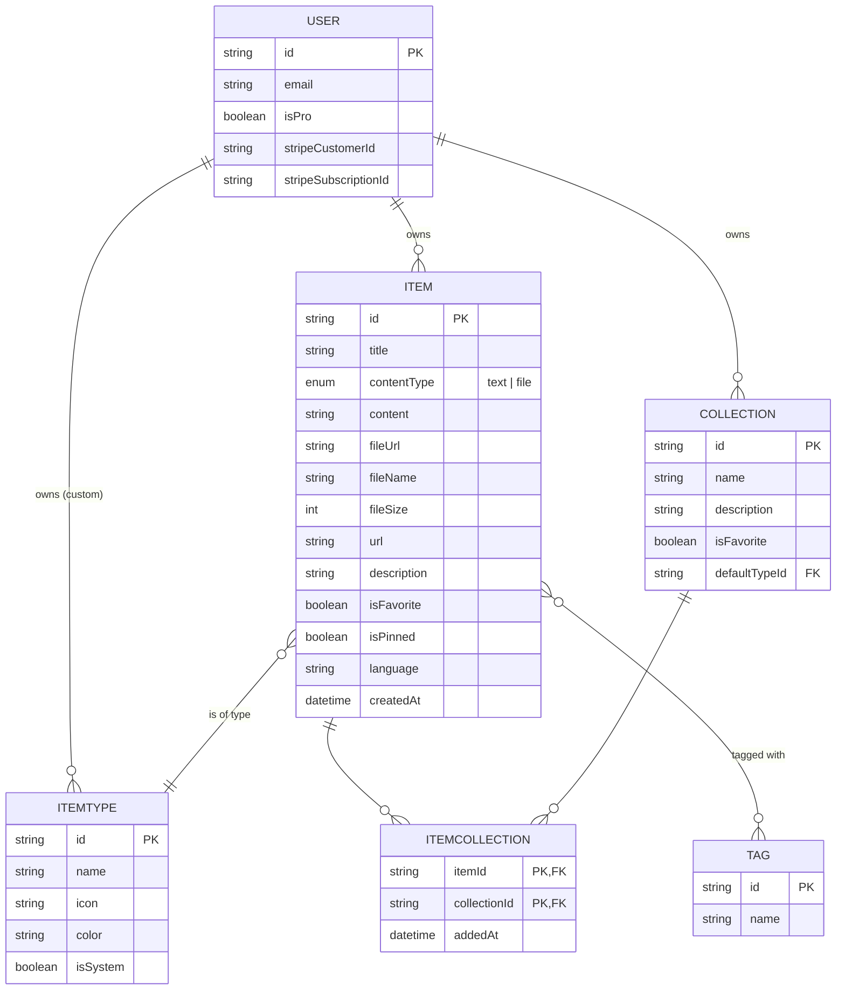

# DevStash — Project Overview

> One fast, searchable, AI-enhanced hub for all developer knowledge & resources.

---

## 1. The Problem

Developers keep their essentials scattered across too many tools:

| Asset                | Usually lives in           |
| -------------------- | -------------------------- |
| 🧩 Code snippets     | VS Code, Notion            |
| 🤖 AI prompts        | ChatGPT / Claude chats     |
| 📄 Context files     | Buried in project folders  |
| 🔗 Useful links      | Browser bookmarks          |
| 📚 Docs              | Random folders             |
| ⌨️ Terminal commands | `.txt` files, bash history |
| 🗂️ Templates         | GitHub gists               |

The result: **context switching, lost knowledge, and inconsistent workflows.**

**DevStash** solves this by being the single, fast, searchable home for all of it — supercharged with AI.

---

## 2. Target Users

| Persona                        | Primary Need                                        |
| ------------------------------ | --------------------------------------------------- |
| **Everyday Developer**         | Fast access to snippets, prompts, commands, links   |
| **AI-first Developer**         | Saves prompts, contexts, workflows, system messages |
| **Content Creator / Educator** | Stores code blocks, explanations, course notes      |
| **Full-stack Builder**         | Collects patterns, boilerplates, API examples       |

---

## 3. Features

### A. Items & Item Types

Every piece of stored content is an **Item** belonging to a **Type**. Users can create custom types later, but the system ships with these built-ins:

| Type    | Content | Color        | Icon (Lucide) | Free Tier |
| ------- | ------- | ------------ | ------------- | --------- |
| Snippet | text    | `#3b82f6` 🔵 | `Code`        | ✅        |
| Prompt  | text    | `#8b5cf6` 🟣 | `Sparkles`    | ✅        |
| Command | text    | `#f97316` 🟠 | `Terminal`    | ✅        |
| Note    | text    | `#fde047` 🟡 | `StickyNote`  | ✅        |
| Link    | url     | `#10b981` 🟢 | `Link`        | ✅        |
| File    | file    | `#6b7280` ⚫ | `File`        | 💎 Pro    |
| Image   | file    | `#ec4899` 🩷 | `Image`       | 💎 Pro    |

**Behaviors**

- Items open in a **quick-access drawer** for fast view/edit
- URL pattern: `/items/snippets`, `/items/prompts`, etc.
- Markdown editor for text types
- Syntax highlighting for code blocks
- File upload (R2) for file/image types

### B. Collections

Groupings of items. An item can belong to **multiple collections** (many-to-many via join table).

Examples:

- _React Patterns_ — snippets + notes
- _Context Files_ — files
- _Python Snippets_ — snippets
- _Interview Prep_ — mixed

Each collection has a `defaultTypeId` so a new empty collection knows what color to render as.

### C. Search

Powerful search across:

- Content
- Tags
- Titles
- Types

### D. Authentication

Powered by **NextAuth v5**:

- Email + password
- GitHub OAuth

### E. Quality-of-life Features

- ⭐ Favorites for collections and items
- 📌 Pin items to top
- 🕓 Recently used
- 📥 Import code from a file
- ✍️ Markdown editor (text types)
- 📤 Export data (JSON / ZIP) — _Pro_
- 🌙 Dark mode (default), light mode optional
- 🔗 View which collections an item belongs to, add/remove on the fly

### F. AI Features (Pro)

Powered by **OpenAI `gpt-5-nano`**:

- 🏷️ Auto-tag suggestions
- 📝 Summaries
- 💡 "Explain This Code"
- ✨ Prompt optimizer

---

## 4. Data Model

### Entity Relationship Diagram



### Prisma Schema (draft)

```prisma
// schema.prisma

generator client {
  provider = "prisma-client-js"
}

datasource db {
  provider = "postgresql"
  url      = env("DATABASE_URL")
}

enum ContentType {
  text
  file
}

model User {
  id                   String     @id @default(cuid())
  email                String     @unique
  name                 String?
  image                String?
  emailVerified        DateTime?

  // Monetization
  isPro                Boolean    @default(false)
  stripeCustomerId     String?    @unique
  stripeSubscriptionId String?    @unique

  // Relations
  accounts             Account[]
  sessions             Session[]
  items                Item[]
  collections          Collection[]
  itemTypes            ItemType[] // custom types

  createdAt            DateTime   @default(now())
  updatedAt            DateTime   @updatedAt
}

model Item {
  id           String           @id @default(cuid())
  title        String
  contentType  ContentType      @default(text)
  content      String?          @db.Text
  fileUrl      String?
  fileName     String?
  fileSize     Int?
  url          String?          // for link type
  description  String?
  isFavorite   Boolean          @default(false)
  isPinned     Boolean          @default(false)
  language     String?          // for syntax highlighting

  userId       String
  user         User             @relation(fields: [userId], references: [id], onDelete: Cascade)

  itemTypeId   String
  itemType     ItemType         @relation(fields: [itemTypeId], references: [id])

  collections  ItemCollection[]
  tags         Tag[]            @relation("ItemTags")

  createdAt    DateTime         @default(now())
  updatedAt    DateTime         @updatedAt

  @@index([userId])
  @@index([itemTypeId])
}

model ItemType {
  id          String   @id @default(cuid())
  name        String
  icon        String   // Lucide icon name
  color       String   // hex
  isSystem    Boolean  @default(false)

  userId      String?  // null for system types
  user        User?    @relation(fields: [userId], references: [id], onDelete: Cascade)

  items       Item[]
  defaultFor  Collection[] @relation("CollectionDefaultType")

  @@unique([userId, name])
}

model Collection {
  id             String           @id @default(cuid())
  name           String
  description    String?
  isFavorite     Boolean          @default(false)

  defaultTypeId  String?
  defaultType    ItemType?        @relation("CollectionDefaultType", fields: [defaultTypeId], references: [id])

  userId         String
  user           User             @relation(fields: [userId], references: [id], onDelete: Cascade)

  items          ItemCollection[]

  createdAt      DateTime         @default(now())
  updatedAt      DateTime         @updatedAt

  @@index([userId])
}

model ItemCollection {
  itemId       String
  collectionId String
  addedAt      DateTime   @default(now())

  item         Item       @relation(fields: [itemId], references: [id], onDelete: Cascade)
  collection   Collection @relation(fields: [collectionId], references: [id], onDelete: Cascade)

  @@id([itemId, collectionId])
  @@index([collectionId])
}

model Tag {
  id     String @id @default(cuid())
  name   String @unique
  items  Item[] @relation("ItemTags")
}

// --- NextAuth standard models below (Account, Session, VerificationToken) ---
```

> ⚠️ **Migrations only.** Never use `prisma db push` or manually edit the DB. All schema changes go through `prisma migrate` in dev, then deployed to prod.

---

## 5. Tech Stack

| Layer        | Choice                              | Notes                            |
| ------------ | ----------------------------------- | -------------------------------- |
| Framework    | **Next.js 16 / React 19**           | SSR + API routes, single repo    |
| Language     | **TypeScript**                      | Strict mode                      |
| Database     | **Neon Postgres**                   | Serverless Postgres              |
| ORM          | **Prisma 7**                        | Always fetch latest docs         |
| Auth         | **NextAuth v5**                     | Email/password + GitHub          |
| File Storage | **Cloudflare R2**                   | For Pro file/image uploads       |
| Caching      | **Redis** (maybe)                   | Defer until needed               |
| AI           | **OpenAI `gpt-5-nano`**             | All AI features                  |
| Styling      | **Tailwind CSS v4** + **ShadCN UI** |                                  |
| Payments     | **Stripe**                          | Subscriptions (monthly / yearly) |

---

## 6. Monetization

Freemium model. **During development, all features are unlocked for all users** — gate them behind `user.isPro` once we go live.

### Free Tier

- 50 items total
- 3 collections
- All system types **except** files & images
- Basic search
- ❌ No file/image upload
- ❌ No AI features

### Pro Tier — **$8/month** or **$72/year** _(save $24)_

- Unlimited items & collections
- File & image uploads
- Custom item types _(later)_
- AI auto-tagging, code explanation, prompt optimizer
- Export data (JSON / ZIP)
- Priority support

---

## 7. UI / UX

### Design Principles

- Modern, minimal, **developer-focused**
- Dark mode by default; light mode optional
- Clean typography, generous whitespace
- Subtle borders and shadows
- **References:** Notion · Linear · Raycast
- Syntax highlighting on every code block

### Screenshots

Refer to the screenshots below as a base for dashboard UI.
It does not have to be exact. Use it as a reference.

- @context/screenshots/dashboard-ui-drawer.png
- @context/screenshots/dashboard-ui-main.png

### Layout

```
┌──────────────┬─────────────────────────────────────────────┐
│              │                                             │
│   SIDEBAR    │              MAIN CONTENT                   │
│ (collapsible)│                                             │
│              │   ┌─────────┐ ┌─────────┐ ┌─────────┐       │
│ • Snippets   │   │ React   │ │ Python  │ │ Prompts │       │
│ • Prompts    │   │Patterns │ │Snippets │ │         │       │
│ • Commands   │   └─────────┘ └─────────┘ └─────────┘       │
│ • Notes      │                                             │
│ • Links      │   Items (color-coded border by type)        │
│ • Files 💎   │   ┌──┐ ┌──┐ ┌──┐ ┌──┐                       │
│ • Images 💎  │   └──┘ └──┘ └──┘ └──┘                       │
│              │                                             │
│ Collections  │                                             │
│ • Recent...  │                                             │
└──────────────┴─────────────────────────────────────────────┘
                          ↓ click item
                ┌─────────────────────┐
                │   ITEM DRAWER       │
                │   (quick view/edit) │
                └─────────────────────┘
```

- **Sidebar:** Item types (linking to `/items/{type}`), latest collections
- **Main:** Grid of collection cards — background color reflects the dominant item type inside; items below show color-coded borders matching their type
- **Drawer:** Items open in a quick-access drawer rather than a full page

### Responsive

- Desktop-first, mobile-usable
- Sidebar collapses to a drawer on mobile

### Micro-interactions

- Smooth transitions
- Hover states on cards
- Toast notifications for actions
- Loading skeletons

---

## 8. Key URL Patterns

| Path                | Purpose                                            |
| ------------------- | -------------------------------------------------- |
| `/`                 | Dashboard (collections + recent items)             |
| `/items/[type]`     | All items of a given type (e.g. `/items/snippets`) |
| `/collections`      | All collections                                    |
| `/collections/[id]` | Single collection view                             |
| `/search`           | Global search                                      |
| `/settings`         | Account, billing, preferences                      |
| `/api/...`          | API routes (items, uploads, AI, Stripe webhooks)   |

---

## 9. Open Questions / TBD

- Redis caching — defer until we have load data
- Custom item types — Pro feature, post-launch
- Team/shared collections — possible future tier
- Public sharing of individual items (read-only links)?

---

_Last updated: May 2026_
